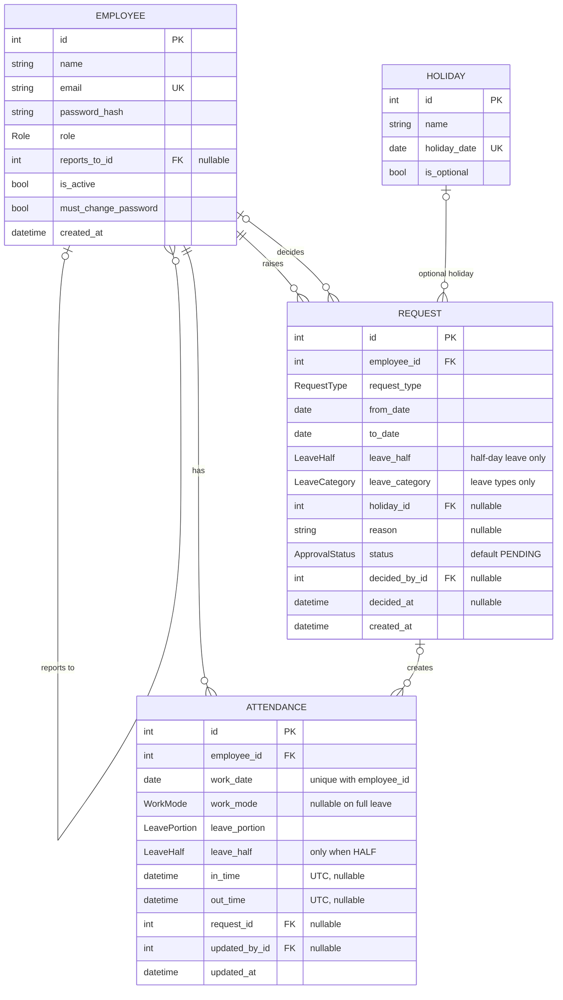

# Database schema

Source of truth for the data model. Update this file in the same pull request as any model or migration change.

GitHub renders the diagram below automatically.

## Tables

### employee

| Field | Type | Rules |
|---|---|---|
| id | int | primary key |
| name | string | required |
| email | string | required, unique, stored lowercase |
| password_hash | string | bcrypt hash, never the plain password |
| role | Role | default EMPLOYEE |
| reports_to_id | int → employee.id | nullable; empty until managers exist |
| is_active | bool | default true; inactive users cannot sign in |
| must_change_password | bool | true after HR creates the account |
| created_at | datetime (UTC) | set on insert |

### attendance

One row per employee per day. Records what actually happened.

| Field | Type | Rules |
|---|---|---|
| id | int | primary key |
| employee_id | int → employee.id | required |
| work_date | date | required; unique together with employee_id |
| work_mode | WorkMode | nullable only when leave_portion = FULL |
| leave_portion | LeavePortion | default NONE |
| leave_half | LeaveHalf | required when leave_portion = HALF, otherwise empty |
| in_time | datetime (UTC) | nullable (leave day, or not checked in yet) |
| out_time | datetime (UTC) | nullable; must be after in_time |
| request_id | int → request.id | nullable; the approved request that set this day |
| updated_by_id | int → employee.id | nullable; last person who edited (e.g. HR correction) |
| updated_at | datetime (UTC) | set on insert and update |

Not stored: **is_late** is calculated from `in_time` (late after OFFICE_START + LATE_BUFFER_MIN, i.e. 11:00 Asia/Kolkata).

### request

What was asked for and the decision. Covers leave and WFH.

| Field | Type | Rules |
|---|---|---|
| id | int | primary key |
| employee_id | int → employee.id | who asked |
| request_type | RequestType | required |
| from_date / to_date | date | to_date ≥ from_date; weekends and holidays skipped |
| leave_half | LeaveHalf | required for HALF_DAY_LEAVE and HALF_LEAVE_HALF_WFH |
| leave_category | LeaveCategory | required for leave types, empty for WFH types |
| holiday_id | int → holiday.id | only when leave_category = OPTIONAL_HOLIDAY |
| reason | string | required for WFH beyond the free limit |
| status | ApprovalStatus | default PENDING |
| decided_by_id | int → employee.id | who approved or rejected |
| decided_at | datetime (UTC) | when decided |
| created_at | datetime (UTC) | used for the "apply 1 day in advance" rule |

### holiday

| Field | Type | Rules |
|---|---|---|
| id | int | primary key |
| name | string | required |
| holiday_date | date | unique |
| is_optional | bool | optional holidays are taken through a request |

## Enums

| Enum | Values |
|---|---|
| Role | EMPLOYEE, MANAGER, HR |
| WorkMode | OFFICE, WFH, HYBRID |
| LeavePortion | NONE, HALF, FULL |
| LeaveHalf | FIRST_HALF, SECOND_HALF |
| RequestType | FULL_LEAVE, HALF_DAY_LEAVE, HALF_LEAVE_HALF_WFH, HALF_WFH, FULL_WFH |
| LeaveCategory | CASUAL, SICK, EARNED, OPTIONAL_HOLIDAY |
| ApprovalStatus | PENDING, APPROVED, REJECTED |

## How a request maps to attendance

| Day | leave_portion | leave_half | work_mode | Counts towards WFH limit |
|---|---|---|---|---|
| Normal office day | NONE | — | OFFICE | 0 |
| FULL_WFH | NONE | — | WFH | 1 |
| HALF_WFH | NONE | — | HYBRID | 0.5 |
| HALF_DAY_LEAVE | HALF | FIRST or SECOND | OFFICE | 0 |
| HALF_LEAVE_HALF_WFH | HALF | FIRST or SECOND | WFH | 0.5 |
| FULL_LEAVE | FULL | — | empty | 0 |

## Business rules

- WFH: 2 free days per employee per calendar month (`WFH_FREE_DAYS_PER_MONTH`). Beyond that, choosing WFH creates a PENDING request.
- Approval routing: a request goes to the employee's `reports_to` manager; if empty, to HR.
- Leave should be applied at least 1 day in advance (checked against `request.created_at`).
- When a request is APPROVED, the backend creates or updates the matching attendance rows and sets `request_id`.
- All date-times are stored in UTC and evaluated in Asia/Kolkata.

## Future (not in this version)

- Leave balances per employee and category
- Notifications
- Full audit log of attendance edits
